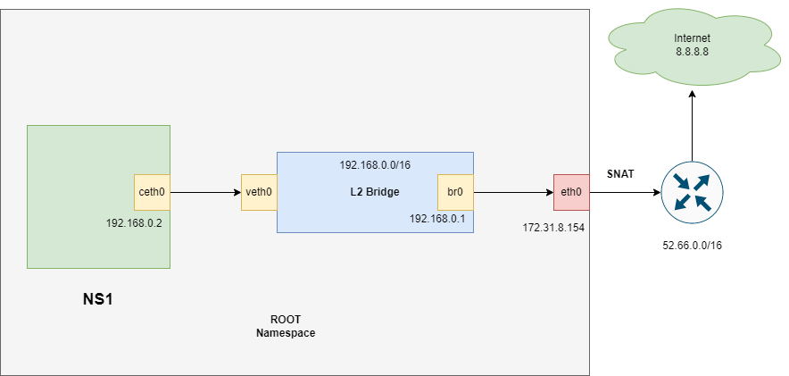
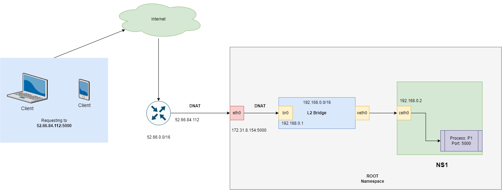

# DevOps 

--------
## Responsibility: 
DevOps work will be very smooth so that everyone feel there are no DevOps engineers in this company.

## Topics:
Networking is the most important part of DevOps. If you understand the networking then the DevOps journey will be very smooth.  

**Understand the basic of networking:** 

1. [Packet Traveling](https://www.practicalnetworking.net/series/packet-traveling/packet-traveling/)
2. [Address Resolution Protocol](https://www.practicalnetworking.net/series/arp/address-resolution-protocol/)
3. [Network Address Translation](https://www.practicalnetworking.net/series/nat/nat/)
4. Network interface
5. Default gateway
6. Ifconfig
7. Tcpdump
8. Telnet
9. Nslookup, Dig
10. Egress, Ingress
11. Bgp
12. Traceroute
13. Private IP vs Public IP
14. CIDR

> **OS: Ubuntu 20.4**
> 
----
### Ifconfig

---
**Device network interface:**

    ifconfig

**Output:**

    br-26d76cebef36: flags=4099<UP,BROADCAST,MULTICAST>  mtu 1500
            inet 172.21.0.1  netmask 255.255.0.0  broadcast 172.21.255.255
            ether 02:42:a7:04:df:25  txqueuelen 0  (Ethernet)
            RX packets 0  bytes 0 (0.0 B)
            RX errors 0  dropped 0  overruns 0  frame 0
            TX packets 0  bytes 0 (0.0 B)
            TX errors 0  dropped 0 overruns 0  carrier 0  collisions 0

    wlo1: flags=4163<UP,BROADCAST,RUNNING,MULTICAST>  mtu 1500
            inet 192.168.0.11  netmask 255.255.255.0  broadcast 192.168.0.255
            inet6 fe20::4f2a:81d6:fcb5:3339  prefixlen 64  scopeid 0x20<link>
            ether ad:d1:b8:3b:e3:80  txqueuelen 1000  (Ethernet)
            RX packets 504918  bytes 590694806 (590.6 MB)
            RX errors 0  dropped 19  overruns 0  frame 0
            TX packets 134926  bytes 19230344 (19.2 MB)
            TX errors 0  dropped 0 overruns 0  carrier 0  collisions 0

My device use wlo1 interface for sending and receiving packet. This interface attaches with NIC card (network interface card)
NIC card communication with my home Wi-Fi router. Connection medium wireless.  

**Flow:**
`NIC card -> wlo1 (software interface) -> kernel -> application.
`

### Private IP range:

* Class A: 10.0.0.0 — 10.255.255.255
* Class B: 172.16.0.0 — 172.31.255.255
* Class C: 192.168.0.0 — 192.168.255.255 

Others are public IP.

### Tcpdump

---

`tcpdump` is a packet analyzer that is launched from the command line. It can be used to analyze network traffic by 
intercepting and displaying packets that are being created or received by the computer it's running on.

> tcpdump and browser network tool are the most used tool for DevOps engineers.

**Command:**

    sudo tcpdump -i wlo1

**Output:**

    00:50:15.279317 IP rakibul.56602 > 20.205.243.166.https: Flags [.], ack 40, win 2286, options [nop,nop,TS val 2913712898 ecr 3081109833], length 0
    00:50:15.316861 IP 172.16.172.10.domain > rakibul.54007: 38873 NXDomain 0/1/0 (119)
    00:50:15.318788 IP rakibul.38604 > 172.16.172.10.domain: 52502+ [1au] PTR? 166.243.205.20.in-addr.arpa. (56)
    00:50:15.448731 IP 172.16.172.10.domain > rakibul.38604: 52502 NXDomain 0/1/1 (142)
    00:50:15.449011 IP rakibul.38604 > 172.16.172.10.domain: 52502+ PTR? 166.243.205.20.in-addr.arpa. (45)

> Hurricane Electric: [BGP Hurricane](https://bgp.he.net/). Using this site we can see Who owns this IP address.
> 

**Now we see only https (443) requests:**

`sudo tcpdump -i wlo1 dst port 443
`

**Also, we can see specific host requests:**

    Command:
        sudo tcpdump -i wlo1 host 36.255.68.136
    Output:
        tcpdump: verbose output suppressed, use -v or -vv for full protocol decode
        listening on wlo1, link-type EN10MB (Ethernet), capture size 262144 bytes
        01:39:39.256868 IP rakibul.44384 > 36.255.68.136.https: Flags [S], seq 2760297218, win 64240, options [mss 1460,sackOK,TS val 2317664066 ecr 0,nop,wscale 7], length 0
        01:39:39.257543 IP rakibul.44386 > 36.255.68.136.https: Flags [S], seq 2045664474, win 64240, options [mss 1460,sackOK,TS val 2317664066 ecr 0,nop,wscale 7], length 0
        01:39:39.267871 IP 36.255.68.136.https > rakibul.44384: Flags [S.], seq 329858098, ack 2760297219, win 28960, options [mss 1280,sackOK,TS val 3666846209 ecr 2317664066,nop,wscale 7], length 0
        01:39:39.267917 IP rakibul.44384 > 36.255.68.136.https: Flags [.], ack 1, win 502, options [nop,nop,TS val 2317664077 ecr 3666846209], length 0

### Telnet 

---
Telnet utility allows users to test connectivity to remote machines and issue commands through the use of a 
keyboard. Though most users opt to work with graphical interfaces, Telnet is one of the simplest ways to check 
connectivity on certain ports.

**Command:**

    telnet 185.199.108.154 443

**Output:**

    Trying 185.199.108.154...
    Connected to 185.199.108.154.
    Escape character is '^]'.

### Nslookup, Dig

---
`nslookup` is an abbreviation of name server lookup and allows you to query your DNS service. The tool is typically used 
to obtain a domain name via your command line interface (CLI), receive IP address mapping details, and lookup DNS records.

**Command:**

    nslookup www.google.com

**Output:**

    Server:		127.0.0.53
    Address:	127.0.0.53#53
    
    Non-authoritative answer:
    Name:	www.google.com
    Address: 74.125.68.105
    Name:	www.google.com
    Address: 74.125.68.103

or 

` dig www.google.com
`

### Egress Packet

---
Packet what goes outside called Egress Traffic. Let's say we are doing ping request from the `NS1` to google dns `8.8.8.8`

**Ping Google DNS:**

    ping 8.8.8.8

**Output:**

    PING 8.8.8.8 (8.8.8.8) 56(84) bytes of data. 
    64 bytes from 8.8.8.8: icmp_seq=1 ttl=112 time=117 ms 
    64 bytes from 8.8.8.8: icmp_seq=2 ttl=112 time=60.5 ms 
    ^C 
    --- 8.8.8.8 ping statistics ---
    2 packets transmitted, 2 received, 0% packet loss, time 1000ms
    rtt min/avg/max/mdev = 60.515/88.792/117.069/28.277 ms
        
So, let's visualize how the network packet will travel? ([src](https://github.com/dipanjal/DevOps/tree/main/NetNS_Ingress_Egress_Traffic#egress-packet-flow))

Better Resolution:
1. The packet will reach from NS1 `ceth0` to the Bridge `br0` 
2. Packet will be forwarded from Bridge `br0` to RootNS `eth0` via `br0` (Default Gateway)
3. Packet will go out from `eth0` to `outside` using `SNAT`

### Ingress Packet

---
Packet what `comes inside` from outside called Ingress Traffic Let's assume we are running a `web server` inside `NS1` 
which is listening on port `5000`. If we try to access this server from outside, how the packet will flow?
([src](https://github.com/dipanjal/DevOps/tree/main/NetNS_Ingress_Egress_Traffic#ingress-packet-flow))

Better Resolution:
1. Packet will reach from `outside` to `eth0`
2. from eth0 to `br0` using `DNAT`
3. `br0` (Default GW) to NS1 `ceth0`

### Traceroute

---

Traceroute is a command that runs tools used for network diagnostics. These tools trace the path's data packets take from 
their source to their destinations, allowing administrators to better resolve connectivity issues. On a Windows machine, 
this command is called `tracert`; on Linux and Mac, it's called `traceroute`.

**Command:**

    traceroute 172.217.163.206

**Output:**

    traceroute to 172.217.163.206 (172.217.163.206), 64 hops max
    1   192.168.0.1  3.671ms  3.988ms  4.124ms 
    2   59.153.100.20  10.668ms  7.066ms  5.840ms 
    3   172.16.16.73  5.852ms  5.157ms  7.321ms 
    4   59.153.100.109  6.826ms  6.112ms  12.591ms 
    5   103.15.245.233  53.978ms  54.968ms  54.814ms 
    6   157.119.185.81  55.717ms  51.255ms  52.470ms 
    7   72.14.223.14  77.434ms  74.613ms  75.259ms 
    8   *  *  * 
    9   74.125.253.12  107.913ms  204.304ms  102.292ms 
    10   209.85.248.211  76.668ms  77.107ms  75.571ms 
    11   172.217.163.206  76.285ms  76.197ms  72.566ms 

**It's use `11` hops to reach the destination.**

We can check ip owners using [BGP Hurricane](https://bgp.he.net/)

### Network congestion

---

In short, `network congestion` occurs when the network is exchanging/carrying more data than it can comfortably handle. 
This also could be a reason why one minute you are able to connect your devices to a network, then lose the connection 
altogether and have a hard time reconnecting.

### How to implement traceroute in python?

---
...