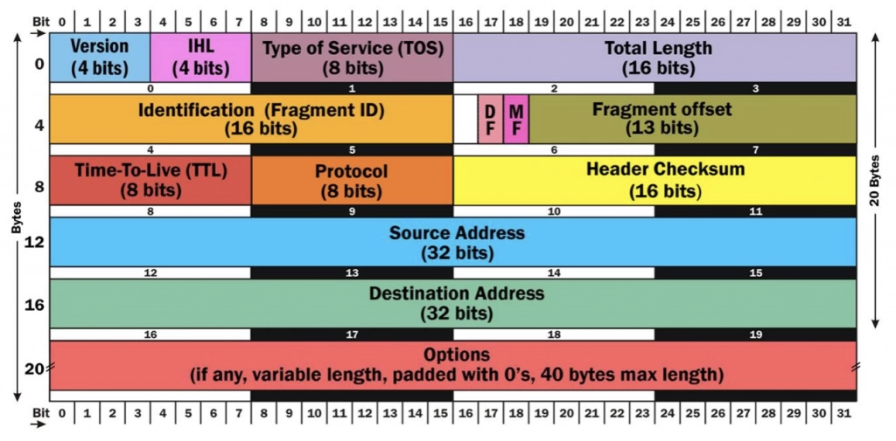

# [Tcpdump](https://danielmiessler.com/study/tcpdump/)
## Question and Answer 

---

### 1. Draw the IP Header with detailed bits.
IP Header is meta information at the beginning of an IP packet. It displays information such as the IP version, 
the packet’s length, the source, and the destination.

IPV4 header format is 20 to 60 bytes in length. It contains information need for routing and delivery. It consists of 
13 fields such as Version, Header length, total distance, identification, flags, checksum, source IP address, 
destination IP address. It provides essential data need to transmit the data. [For more information](https://www.guru99.com/ip-header.html)

---

### 2. What is [tcpdump](https://www.tcpdump.org/manpages/tcpdump.1.html)?
`tcpdump` is the world’s premier network analysis tool—combining both power and simplicity into a single command-line interface.

---
### 3. How to get the HTTPS traffic? Share the command!

    tcpdump -nnSX port 443
This showed some HTTPS traffic, with a hex display visible on the right portion of the output (alas, it’s encrypted). 
Just remember—when in doubt, run the command above with the port you’re interested in, and you should be on your way.
---
### 4. For everything on an interface, what is the command?
    tcpdump -i eth0
---
### 5. Write the command to find Traffic by IP.
One of the most common queries, using host, you can see traffic that’s going to or from 1.1.1.1     

    tcpdump host 1.1.1.1
---

### 6. Share the filtering by Source and/or Destination?
If you only want to see traffic in one direction or the other, you can use src and dst.

    tcpdump src 1.1.1.1
    tcpdump dst 1.0.0.1
---
### 7. How to find Packets by Network, write the line.
To find packets going to or from a particular network or subnet, use the net option.

    tcpdump net 1.2.3.0/24

---
### 8. Using packet contents with Hex Output, write the command.
Hex output is useful when you want to see the content of the packets in question, and it’s often best used when you’re 
isolating a few candidates for closer scrutiny.

    tcpdump -c 1 -X icmp        # icmp (Internet Control Message Protocol)
---
### 9. To find a specific port traffic, write the command.
You can find specific port traffic by using the port option followed by the port number.

    tcpdump port 3389
    tcpdump src port 1025
---
### 10. Show Traffic of One Protocol command.
If you’re looking for one particular kind of traffic, you can use tcp, udp, icmp, and many others as well.

    tcpdump icmp
---
### 11. Write the command showing only IP6 Traffic.
You can also find all IP6 traffic using the protocol option.

    tcpdump ip6
---
### 12. Write the command for finding Traffic Using Port Ranges.
You can also use a range of ports to find traffic.

    tcpdump portrange 21-23

---
### 13. [What are PCAP (PEE-cap) files?](https://www.comparitech.com/net-admin/pcap-guide/)
PCAP files are data files created using a program. These files contain packet data of a network and are used to analyze 
the network characteristics. They also contribute to controlling the network traffic and determining network status. 
Using PCAP files, teams can attend to detect network problems and resolve data communications using various programs.
PCAP comes in a range of formats including `Libpcap`, `WinPcap`, and `PCAPng`.
---

### 14. How are PCAP files processed and why is it so?
 PCAP files can be processed by hundreds of different applications, including network analyzers, intrusion detection systems, and of course by tcpdump itself.
> [PCAP file process using python.](https://vnetman.github.io/pcap/python/pyshark/scapy/libpcap/2018/10/25/analyzing-packet-captures-with-python-part-1.html)
---

### 15. Which switch is used to write the PCAP file called capture_file?
Here we’re writing to a file called capture_file using the `-w switch`.

---

### 16. What is the command for reading / writing to capture a File?
    tcpdump port 80 -w capture_file     # PCAP writing command

    tcpdump -r capture_file     # PCAP reading command
---

### 17. Which switch is needed to read the PCAP files?
You can read PCAP files by using the `-r switch`. Note that you can use all the regular commands within tcpdump while 
reading in a file; you’re only limited by the fact that you can’t capture and process what doesn't exist in the file already.
---

### 18. What is the tcpdump command while reading in a file?

---

### 19. Which switch is used for the ethernet header?

---

### 20. What is Line-readable output? How is it notified?

---

### 21. What does -q implify?

---

### 22. What does this tweak: -t work?

---

### 23. What does -tttt show?

---

### 24. To listen on the eth0 interface, which one is used?

---

### 25. Purpose for -vv ?

---

### 26. Purpose for -c?

---

### 27. Why -s is used?

---

### 28. What does -S, -e, -q, -E implify?

---

### 29. How to show the raw output view?

---

### 30. If a specific IP and destined course are given then which tweak is used for?

---

### 31. To pass from From One Network to Another, the command?

---

### 32. If a Non ICMP Traffic Goes to a Specific IP, what should be the query?

---

### 33. If a host isn't on a specific port, what will be tweaked and commanded?

---

### 34. Why single quotes used?

---

### 35. How to isolate TCP RST flags?

---

### 36. To Isolate TCP SYN flags, which query is used?

---

### 37. To Isolate packets that have both the SYN and ACK flags set, what shouldbe the command?

---

### 38. How to Isolate TCP URG flags?

---

### 39. How to Isolate TCP ACK flags?

---

### 40. Isolate TCP PSH flags?

---

### 41. Isolate TCP FIN flags.

---

### 42. How is grep used?

---

### 43. Command for Both SYN and RST?

---

### 44. What to do for Cleartext GET Requests?

---

### 45. What to do to Find HTTP Host Headers?

---

### 46. How to Find HTTP Cookies?

---

### 47. The command line for Find SSH Connections?

---

### 48. How to Find DNS Traffic?

---

### 49. Command for Find FTP Traffic.

---

### 50. Find NTP Traffic, what is the command?

---

### 51. Command to Find Cleartext Passwords?

---

### 52. Command to Find Cleartext Passwords?

---

### 53. Describe Evil bit.

---

### 54. Write the fun filter to find packets where it’s been toggled.

---