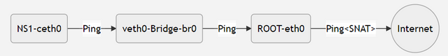
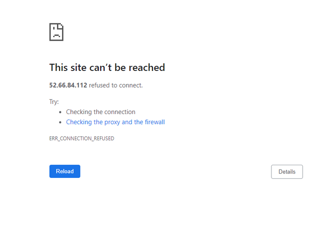
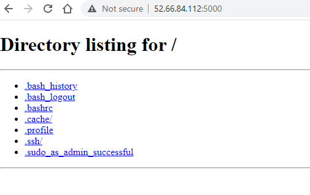

# [Namespace](https://github.com/dipanjal/DevOps/tree/main/NetNS_Ingress_Egress_Traffic)

### There are 4 type of docker namespaces:
1. Network namespace.
2. Volume ns / MWT ns
3. Process ns.
4. CGroup ns.

> Process and port are mapped one to one.

> Docker bridger is a layer two switch.
> 
> Every docker container is a namespace.
> 

### What is Network Namespace ?
Network namespace is a Linux kernel feature allows us to isolate network environments through virtualization. For 
example, using network namespaces, you can create separate network interfaces and routing tables that are isolated from 
the rest of the system and operate independently. Network Namespace is a core component of Docker Networking. Today we 
are going to simulate the Docker Networking from Scratch.
### To check all network interfaces:
    
    ip link 
    ip addr

### Create network namespace:
    
    sudo ip netns add frontend

### To show netns:
    
    ip netns list
    ls /var/run/netns/

### Create bridge network

    sudo ip link add br0 type bridge
    
**Checking network:** `ip link`

    1: lo: <LOOPBACK,UP,LOWER_UP> mtu 65536 qdisc noqueue state UNKNOWN mode DEFAULT group default qlen 1000
    link/loopback 00:00:00:00:00:00 brd 00:00:00:00:00:00
    2: eth0: <BROADCAST,MULTICAST,UP,LOWER_UP> mtu 9001 qdisc fq_codel state UP mode DEFAULT group default qlen 1000
        link/ether 0a:00:73:8f:35:7c brd ff:ff:ff:ff:ff:ff
    3: br0: <BROADCAST,MULTICAST> mtu 1500 qdisc noop state DOWN mode DEFAULT group default qlen 1000
        link/ether 52:ea:dc:a4:fd:9d brd ff:ff:ff:ff:ff:ff

### Running new bridge network:  
In the first phase when we create a network it's down. We need to up and running this container:

    sudo ip link set br0 up

**Checking network:** `ip link`  lower up

    1: lo: <LOOPBACK,UP,LOWER_UP> mtu 65536 qdisc noqueue state UNKNOWN mode DEFAULT group default qlen 1000
    link/loopback 00:00:00:00:00:00 brd 00:00:00:00:00:00
    2: eth0: <BROADCAST,MULTICAST,UP,LOWER_UP> mtu 9001 qdisc fq_codel state UP mode DEFAULT group default qlen 1000
        link/ether 0a:00:73:8f:35:7c brd ff:ff:ff:ff:ff:ff
    3: br0: <BROADCAST,MULTICAST,UP,LOWER_UP> mtu 1500 qdisc noqueue state UNKNOWN mode DEFAULT group default qlen 1000
        link/ether 52:ea:dc:a4:fd:9d brd ff:ff:ff:ff:ff:ff

now it's up and running.

### Assign ip address in new ns

    sudo ip addr add 192.168.1.1/24 dev br0     # dev means device. Which device I want to add ip.

**Checking ip address:** `ip add`

    3: br0: <BROADCAST,MULTICAST,UP,LOWER_UP> mtu 1500 qdisc noqueue state UNKNOWN group default qlen 1000
    link/ether 52:ea:dc:a4:fd:9d brd ff:ff:ff:ff:ff:ff
    inet 192.168.1.0/24 scope global br0
       valid_lft forever preferred_lft forever
    inet6 fe80::50ea:dcff:fea4:fd9d/64 scope link 
       valid_lft forever preferred_lft forever

Now we can see our bridge network got an IP address.

### Optional: Delete ip address form network interface

    sudo ip addr del 192.168.1.0/24 dev br0

### Check if br0 can receive packet or not:
Ping to our new address.
    
    ping 192.168.1.1

### Add ethernet to our bridge network:

    sudo ip link add veth0 type veth peer name geth0

**Checking :** `ip add`

    4: geth0@veth0: <BROADCAST,MULTICAST,M-DOWN> mtu 1500 qdisc noop state DOWN group default qlen 1000
    link/ether 32:db:35:79:01:a8 brd ff:ff:ff:ff:ff:ff
    5: veth0@geth0: <BROADCAST,MULTICAST,M-DOWN> mtu 1500 qdisc noop state DOWN group default qlen 1000
        link/ether 1a:3a:cb:e2:1b:7a brd ff:ff:ff:ff:ff:ff

### Now connect `veth0` to `frontend` ns

    sudo ip link set veth0 netns frontend

now we can see the interfaces using `IP add`, but we can't see the `veth0` port because it does not belong to the root 
namespace. Now it's connected to the frontend ns.

### Other side connect to the br0 `geth0`

    sudo ip link set geth0 master br0

### Connect to the frontend ns:
    
    sudo nsenter --net=/var/run/netns/frontend

**check user:** `whoami`

**check ns:** `ip link`
All ns are down. Now we are up all ns.

    ip link set lo up
    ip link set veth0 up
    ip addr add 192.168.1.2/24 dev veth0

**Check**: `ip link`

    5: veth0@if4: <NO-CARRIER,BROADCAST,MULTICAST,UP> mtu 1500 qdisc noqueue state LOWERLAYERDOWN mode DEFAULT group default qlen 1000
    link/ether 1a:3a:cb:e2:1b:7a brd ff:ff:ff:ff:ff:ff link-netnsid 0

In `veth0` interface lower layer down.

exit from frontend ns.

### Now up `geth0`:
    
    sudo ip link set geth0 up

    4: geth0@if5: <BROADCAST,MULTICAST,UP,LOWER_UP> mtu 1500 qdisc noqueue master br0 state UP group default qlen 1000
    link/ether 32:db:35:79:01:a8 brd ff:ff:ff:ff:ff:ff link-netns frontend
    inet6 fe80::30db:35ff:fe79:1a8/64 scope link 
       valid_lft forever preferred_lft forever

### Route:

    route       # instll net-tools

    Kernel IP routing table
    Destination     Gateway         Genmask         Flags Metric Ref    Use Iface
    default         ip-172-31-0-1.a 0.0.0.0         UG    100    0        0 eth0
    172.31.0.0      0.0.0.0         255.255.240.0   U     0      0        0 eth0
    ip-172-31-0-1.a 0.0.0.0         255.255.255.255 UH    100    0        0 eth0
    192.168.1.0     0.0.0.0         255.255.255.0   U     0      0        0 br0

And frontend ns route:

    Kernel IP routing table
    Destination     Gateway         Genmask         Flags Metric Ref    Use Iface
    192.168.1.0     0.0.0.0         255.255.255.0   U     0      0        0 veth0

`ping 192.168.1.1`

### Kernel IP routing table:

    route -n

    Kernel IP routing table
    Destination     Gateway         Genmask         Flags Metric Ref    Use Iface
    192.168.1.0     0.0.0.0         255.255.255.0   U     0      0        0 veth0

### Now set frontend t0 root namespace communication:
    
Our objective is here to establish communication between Namespace frontend `ceth0` to Root NS `eth0` via Bridge `br0` (Default GW)

Check IP address assigned to eth0

     ip addr show eth0

**Output:**
    
    2: eth0: <BROADCAST,MULTICAST,UP,LOWER_UP> mtu 9001 qdisc fq_codel state UP group default qlen 1000
    link/ether 0a:00:73:8f:35:7c brd ff:ff:ff:ff:ff:ff
    inet 172.31.15.11/20 brd 172.31.15.255 scope global dynamic eth0
       valid_lft 1919sec preferred_lft 1919sec
    inet6 fe80::800:73ff:fe8f:357c/64 scope link 
       valid_lft forever preferred_lft forever

So `172.31.15.11` IP address is assigned to `eth0` of RootNS

Now, log into the Namespace frontend and `ping` to `172.31.15.11`

    sudo nsenter --net=/var/run/netns/frontend
    ping 172.31.15.11

**Output**:
    
    ping: connect: Network is unreachable

**Let's check the route table**

    route

**Output:**

    Kernel IP routing table
    Destination     Gateway         Genmask         Flags Metric Ref    Use Iface
    192.168.1.0     0.0.0.0         255.255.255.0   U     0      0        0 veth0

**Root Cause:**

> The IP doesn't match with any route table entry. Route table match an IP Address using 
> `The Longest Prefix Matching Algorithm` and Looks like the Kernel Level Route Table has no information to send 
> the packet out to `eth0` 1`72.31.15.11/20` network.

**Solution:**

> So need to add a Default Gateway in the route table so that any not matching IP address will be forwarded via `br0` 
> interface having IP 192.168.0.1
> 
>
Ok let's add the default gateway into the Routing Table of frontend.

    ip route add default via 192.168.1.1
    route -n

**Output:**
    
    Kernel IP routing table
    Destination     Gateway         Genmask         Flags Metric Ref    Use Iface
    default         192.168.1.1     0.0.0.0         UG    0      0        0 veth0
    192.168.1.0     0.0.0.0         255.255.255.0   U     0      0        0 veth0

Let's ping to **eth0** again

    ping 172.31.15.11
    
    PING 172.31.15.11 (172.31.15.11) 56(84) bytes of data.
    64 bytes from 172.31.15.11: icmp_seq=1 ttl=64 time=0.057 ms
    64 bytes from 172.31.15.11: icmp_seq=2 ttl=64 time=0.052 ms
    64 bytes from 172.31.15.11: icmp_seq=3 ttl=64 time=0.041 ms
    64 bytes from 172.31.15.11: icmp_seq=4 ttl=64 time=0.041 ms

### Ping 8.8.8.8 from frontend namespace

So far we have done NS (Name spaces) to Bridge and Bridge to RootNS Communication. Now let's take a walk outside.

Let's `ping 8.8.8.8` from frontend

    ping 8.8.8.8

Output:

    PING 8.8.8.8 (8.8.8.8) 56(84) bytes of data.

Now this scenario is little tricky, it's not like the Network is unreachable but somehow the packet is blocked or 
stuck in between somewhere. Lucky that Linux has a utility bin named tcpdump to observe the network interfaces to 
debug the packet flow.

### Packet Debugging
Now open a new SSH session and observe our gateway br0 in RootNS first.

    sudo tcpdump -i br0 icmp
**Output:**
    
    listening on br0, link-type EN10MB (Ethernet), capture size 262144 bytes
    07:29:55.680062 IP ip-192-168-0-2.ap-south-1.compute.internal > dns.google: ICMP echo request, id 63613, seq 2156, length 64
    07:29:56.704054 IP ip-192-168-0-2.ap-south-1.compute.internal > dns.google: ICMP echo request, id 63613, seq 2157, length 64
    07:29:57.728056 IP ip-192-168-0-2.ap-south-1.compute.internal > dns.google: ICMP echo request, id 63613, seq 2158, length 64

Looks like br0 is receiving icmp packets, but how about eth0. Let's check eth0 interface now.

    sudo tcpdump -i eth0 icmp

Output:
    
    tcpdump: verbose output suppressed, use -v or -vv for full protocol decode
    listening on eth0, link-type EN10MB (Ethernet), capture size 262144 bytes
    
Ops! No packets, There is something wrong. Let's check IPv4 forwarding `/proc/sys/net/ipv4/ip_forward`

    cat /proc/sys/net/ipv4/ip_forward
**output:** 0

**Root Cause:** IP Forwarding is disabled. Let's Enable IP Forwarding

    sudo nano /proc/sys/net/ipv4/ip_forward

change it from 0 to 1 and save it, then check it again

    cat /proc/sys/net/ipv4/ip_forward

**output**: 1

Now observe **eth0** again

    sudo tcpdump -i eth0 icmp

**Output**:

    tcpdump: verbose output suppressed, use -v or -vv for full protocol decode
    listening on eth0, link-type EN10MB (Ethernet), capture size 262144 bytes
    07:39:04.544093 IP ip-192-168-0-2.ap-south-1.compute.internal > dns.google: ICMP echo request, id 63613, seq 2692, length 64
    07:39:05.568071 IP ip-192-168-0-2.ap-south-1.compute.internal > dns.google: ICMP echo request, id 63613, seq 2693, length 64
    07:39:06.592091 IP ip-192-168-0-2.ap-south-1.compute.internal > dns.google: ICMP echo request, id 63613, seq 2694, length 64

But still the ping is stuck in `frontend ns` why is that? Notice! that the source ip is `192.168.1.2` which is trying to 
reach out to the Google dns 8.8.8.8. with source ip `192.168.1.2` which is a private ip

### Why I can not access internet through Private IP ?
Think of your `IP address` like your full `postal address`. Letters sent to you from anywhere get delivered by the post 
service reading the address and getting it to the right place.

A `Private IP` address is like having my bedroom as the whole address. It's Useful inside the house, but of no use 
whatsoever for a letter trying to reach you from another country. The poor postman does not know where to start, so the 
letter gets put in the bin. and you get no data.

Simply put, where would the return packets go? You may be able to send a packet out (though it’d probably be dropped by 
a firewall rather early), but how would anyone get a packet back to you? Packets are solely addressed by IP address, 
and private IPs are, by design, not unique. If you do manage to get a packet to a server with a return address of 
`192.168.0.2,` where would it send its answer?

### Solution
To resolve this problem we somehow need to convert the `private ip to public ip`. This is called [NAT](https://whatismyipaddress.com/nat) `(Network Address Translation)`

We need to add a `SNAT (Source NAT)` rule in `IP Table` into the `POSTROUTING` chain

    sudo iptables -t nat -A POSTROUTING -s 192.168.1.0/24 ! -o br0 -j MASQUERADE

We have Done `Source IP NAT` here, it means we are appending (-A) an` IP MASQUERADE Rule` into the `NAT table` (-t) where 
packets coming from source network (-s) `192.168.1.0/24` via output (-o) interface `br0`

More about [iptables](https://medium.com/skilluped/what-is-iptables-and-how-to-use-it-781818422e52)

Now Log into the` Namespace frontend `and try to `ping 8.8.8.8` again

    sudo nsenter --net=/var/run/netns/frontend
    ping 8.8.8.8

**Output:**
    
    PING 8.8.8.8 (8.8.8.8) 56(84) bytes of data.
    64 bytes from 8.8.8.8: icmp_seq=1 ttl=109 time=1.67 ms
    64 bytes from 8.8.8.8: icmp_seq=2 ttl=109 time=1.68 ms
    64 bytes from 8.8.8.8: icmp_seq=3 ttl=109 time=1.71 ms

Eureka!! We have done it. Now we are able to ping outside

### Reach to NS1 from Outside

#### Run an HTTP Server in NS1
Let' log into the `frontend` and run a service, for example run `python3 http module` listening to `port 5000`

    sudo nsenter --net=/var/run/netns/frontend
    python3 -m http.server --bind 192.168.1.2 5000

#### Check Accessibility
Open a new SSH Session and let's try to access from `RootNS`, Let's Check access first.

    telnet 192.168.1.2 5000

**output:**

    Trying 192.168.1.2...
    Connected to 192.168.1.2.
    Escape character is '^]'.

Success! Now initiate a `curl` request

    curl 192.168.1.2:5000

### To check process ID:
    
    netstat -tulpn 5000

**output:**

    <!DOCTYPE HTML PUBLIC "-//W3C//DTD HTML 4.01//EN" "http://www.w3.org/TR/html4/strict.dtd">
    <html>
    <head>
    <meta http-equiv="Content-Type" content="text/html; charset=utf-8">
    <title>Directory listing for /</title>
    </head>
    <body>
    <h1>Directory listing for /</h1>
    

    <ul>
    <li><a href=".bash_history">.bash_history</a></li>
    <li><a href=".bash_logout">.bash_logout</a></li>
    <li><a href=".bashrc">.bashrc</a></li>
    <li><a href=".cache/">.cache/</a></li>
    <li><a href=".profile">.profile</a></li>
    <li><a href=".ssh/">.ssh/</a></li>
    <li><a href=".sudo_as_admin_successful">.sudo_as_admin_successful</a></li>
    </ul>
    

    </body>
    </html>

Awesome, we have got the default response from the server. That means our HTTP server in Up and Running, Listening on port 5000.

Let's try to access using `public-ip:5000` from outside. In my case the VM has public ip `52.66.84.112.` Hence, 
I will request to `52.66.84.112:5000` from my desktop browser.

This is expected. Likewise, we need to do` DNAT (Destination IP NAT)`

    sudo iptables -t nat -A PREROUTING -d 172.31.15.11 -p tcp -m tcp --dport 5000 -j DNAT --to-destination 192.168.1.2:5000

Meaning, any request from exact matched (-m) `tcp protocol` (-p) with Destination (-d) IP `172.31.15.11 (eth0 ip)` with 
`destination port (--dport)` 5000 will jump -j into `DNAT` rule to destination `192.168.1.2:5000`

Let's try again from your browser.

Congratulation! We have configured both Ingress and Egress Traffic successfully.

### References:

1. https://ops.tips/blog/using-network-namespaces-and-bridge-to-isolate-servers/
2. https://serverfault.com/questions/684439/how-to-connect-custom-network-namespace-to-root-network-namespace
3. https://wiki.archlinux.org/title/Network_bridge
4. https://unix.stackexchange.com/questions/255484/how-can-i-bridge-two-interfaces-with-ip-iproute2
5. https://gist.github.com/dpino/6c0dca1742093346461e11aa8f608a99
6. https://medium.com/@abhishek.amjeet/container-networking-using-namespaces-part1-859d317ca1b8
7. https://serverfault.com/questions/568839/linux-network-namespaces-ping-fails-on-specific-veth
8. https://devconnected.com/how-to-add-route-on-linux/
9. https://www.ibm.com/support/pages/using-tcpdump-verify-icmp-polling
10. https://medium.com/skilluped/what-is-iptables-and-how-to-use-it-781818422e52
11. https://www.quora.com/Why-can-we-not-access-the-Internet-through-a-private-IP
